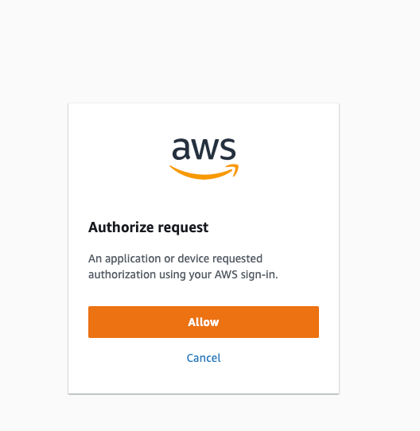
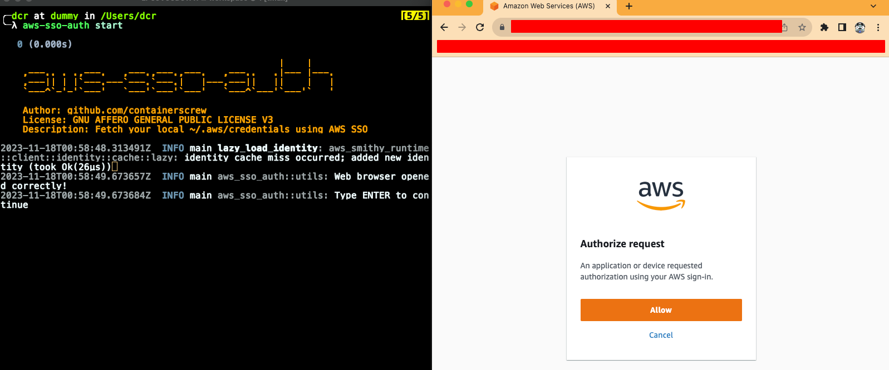
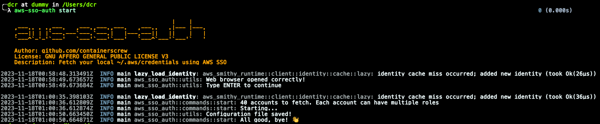

<p align="center" >
    
<h3 align="center">aws-sso-auth</h3>
<p align="center">Fetch your local ~/.aws/credentials using AWS SSO</p>
<p align="center">Build with ❤ in Rust</p>
</p>

<p align="center" >
    <a href="#">
      
    </a>
    <a href="/LICENSE">
      
    </a>
    <a href="https://codecov.io/gh/containerscrew/aws-sso-auth" >
      
    </a>
    <a href="https://github.com/containerscrew/aws-sso-auth/releases/latest">
      
    </a>
    <a href="https://somsubhra.github.io/github-release-stats/?username=containerscrew&repository=aws-sso-auth">
      
    </a>
</p>


<!-- START doctoc generated TOC please keep comment here to allow auto update -->
<!-- DON'T EDIT THIS SECTION, INSTEAD RE-RUN doctoc TO UPDATE -->
**Table of Contents**  *generated with [DocToc](https://github.com/thlorenz/doctoc)*

- [Pipeline badges](#pipeline-badges)
- [Introduction](#introduction)
- [Requirements](#requirements)
- [Supported platforms](#supported-platforms)
- [Supported IDP](#supported-idp)
- [Installation](#installation)
  - [Quick installation](#quick-installation)
  - [Using cargo](#using-cargo)
- [Usage](#usage)
  - [Setup configuration](#setup-configuration)
  - [Start fetching credentials](#start-fetching-credentials)
  - [Debug logging](#debug-logging)
  - [Check version](#check-version)
  - [Help command](#help-command)
  - [Take a look inside `~/.aws/credentials`](#take-a-look-inside-awscredentials)
  - [Example of credentials file](#example-of-credentials-file)
- [Switching accounts in your terminal](#switching-accounts-in-your-terminal)
  - [Zsh/Bash shell](#zshbash-shell)
  - [Fish shell](#fish-shell)
  - [Setting AWS_PROFILE](#setting-aws_profile)
- [Capture examples](#capture-examples)
- [TO DO (not implemented yet)](#to-do-not-implemented-yet)
- [Contribution](#contribution)
- [LICENSE](#license)

<!-- END doctoc generated TOC please keep comment here to allow auto update -->

# Pipeline badges


# Introduction

This tool will help you download your AWS organization's account credentials using `AWS SSO`. What we previously set manually with *IAM users* **(aws_access_key_id and aws_secret_access_key)**, we now have automatically using AWS SSO.
In this case ONLY Google Workspaces has been tested as external IDP. [More info in supported IDP, just below](https://github.com/containerscrew/aws-sso-auth/tree/latest_refactors#supported-idp)

In short, we want to have the credentials of our `AWS accounts/roles`, using `AWS SSO`, stored in our `~/.aws/credentials` to be able to work daily with our tools **(terraform, aws cli...)**

> This tool requires human interaction, since the authorization request must be manually approved from the browser.

# Requirements

* Our default browser that we work with must be authenticated with our IDP. In this case, gmail if we use Google Workspaces.

# Supported platforms

| OS        | ARM64 | AMD64 |
|-----------|:-----:|------:|
| Mac       |  √    |   √   |
| Linux     |  √    |   √   |

# Supported IDP

* Google Workspaces

If using other IDP with AWS SSO in your organization, and this tool don't work, please provide feedback in this repo. Open an issue and I will try to reproduce it!

# Installation

## Quick installation

```shell
curl --proto '=https' --tlsv1.2 -sSfL https://raw.githubusercontent.com/containerscrew/aws-sso-auth/main/scripts/install.sh | bash
```

## Using cargo

Install rust toolchain:

```shell
curl --proto '=https' --tlsv1.2 -sSf https://sh.rustup.rs | sh
```

```shell
cargo install aws-sso-auth --git https://github.com/containerscrew/aws-sso-auth
```

# Usage

## Setup configuration

```shell
aws-sso-auth config --start-url https://XXXX.awsapps.com/start --aws-region eu-west-1 --profile-name mycompany
```

> This command will save a file in `~/.aws/aws-sso-auth.json` with the previous configuration

* **profile_name:** the name of the profile configuration you are saving. For example, your company name
* **start_url:** your start URL of SSO AWS app (https://docs.aws.amazon.com/singlesignon/latest/userguide/howtochangeURL.html)
* **region:** AWS region where you have your AWS SSO configured. By the default is `us-east-1`


## Start fetching credentials

```shell
aws-sso-auth start
```

Or with flags:

```shell
aws-sso-auth start -w 5 -r 40
```

* **workers:** Number of async/thread AWS API calls. + threads == + speed. Recommended: 5/8 max to avoid AWS API 429 errors TooManyRequestsException. Default: 5
* **retries:** Number of retries when AWS API return errors. Default: 50

> This will open your default local browser where you have your IDP authenticated. In my case, I used Google as external IDP with AWS SSO

If everything went well, you must authorize the request. Something like that:



## Debug logging

```shell
aws-sso-auth -l debug start
```

* **--log-level:** Log level. Default: info. Possible values: info, warn, trace, debug, error

## Check version

```shell
aws-sso-auth --version
```

## Help command

```shell
aws-sso-auth --help
```

> All the credentials will be saved in your $HOME/.aws/credentials with the following pattern: [AccountName@RoleName] you are assuming

## Take a look inside `~/.aws/credentials`

```shell
cat ~/.aws/credentials
```

The configuration file should be something like this:

## Example of credentials file

```toml
[Account1@administrator]
aws_secret_access_key=XXXX
region=eu-west-1
aws_access_key_id=XXXX
aws_session_token=XXXX

[Account2@read-only]
aws_secret_access_key=XXXX
region=eu-west-1
aws_access_key_id=XXXX
aws_session_token=XXXX
```

# Switching accounts in your terminal

## Zsh/Bash shell

Copy the following function in your `~/.zshrc` or `~/.bashrc`:

```shell
aws-profile () {
        PROFILE=$(cat ~/.aws/credentials|grep "^\["|sed "s/]$//"|sed "s/^\[//"| fzf)
        export AWS_PROFILE=$PROFILE
}
```

Then, `source` the file if needed:
```shell
source ~/.zshrc or source ~/.bashrc
```

## Fish shell

Copy the following function inside `~/.config/fish/function/aws-profile.fish`

```shell
function aws-profile
    set -Ux AWS_PROFILES $(cat ~/.aws/credentials | sed -n -e 's/^\[\(.*\)\]/\1/p' | fzf)
    if test -n "$AWS_PROFILES"
        set -xg AWS_PROFILE $AWS_PROFILES
        echo "Selected profile: $AWS_PROFILES"
    else
        echo "No profile selected"
    end
end
```

Then `source` the fish configuration:

```shell
source ~/.config/fish/config.fish
```

## Setting AWS_PROFILE

Type `aws-profile` in your terminal, and you will see all the accounts you have credentials in your `$HOME/.aws/credentials`

> **fzf** is needed as a dependency for the interactive account switcher

[Official documentation](https://github.com/junegunn/fzf#installation)

# Capture examples





# TO DO (not implemented yet)

* Multiple AWS SSO account configurations inside `aws-sso-auth.json` Imagine you are working in a consultant, and you have multiple customers with AWS SSO, and you want to save
all their config (start-url, region) inside the config file.
* If you have 200 accounts, only 123 (max), will be fetched
* Select which account credentials (with prefix) do you want to fetch (maybe you don't want to fetch all accounts)
* Testing and mocking AWS API calls
* Codecoverage pipeline not working
* Changelog with release-please
* Create Homebrew Formula
* Documentation in code functions
* Customize how account credentials are saved: `[AccountName@RoleName]` for `[WHATEVER]`

# Contribution

Pull requests are welcome! Any code refactoring, improvement, implementation. I just want to learn Rust! I'm a rookie

# LICENSE

[LICENSE](./LICENSE)
